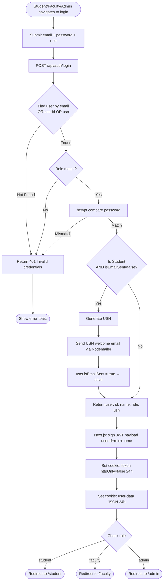
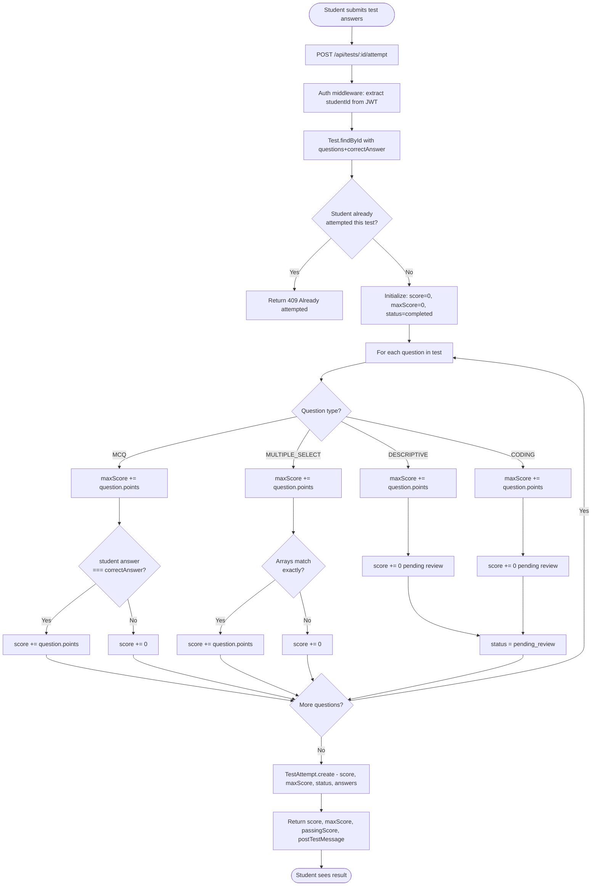
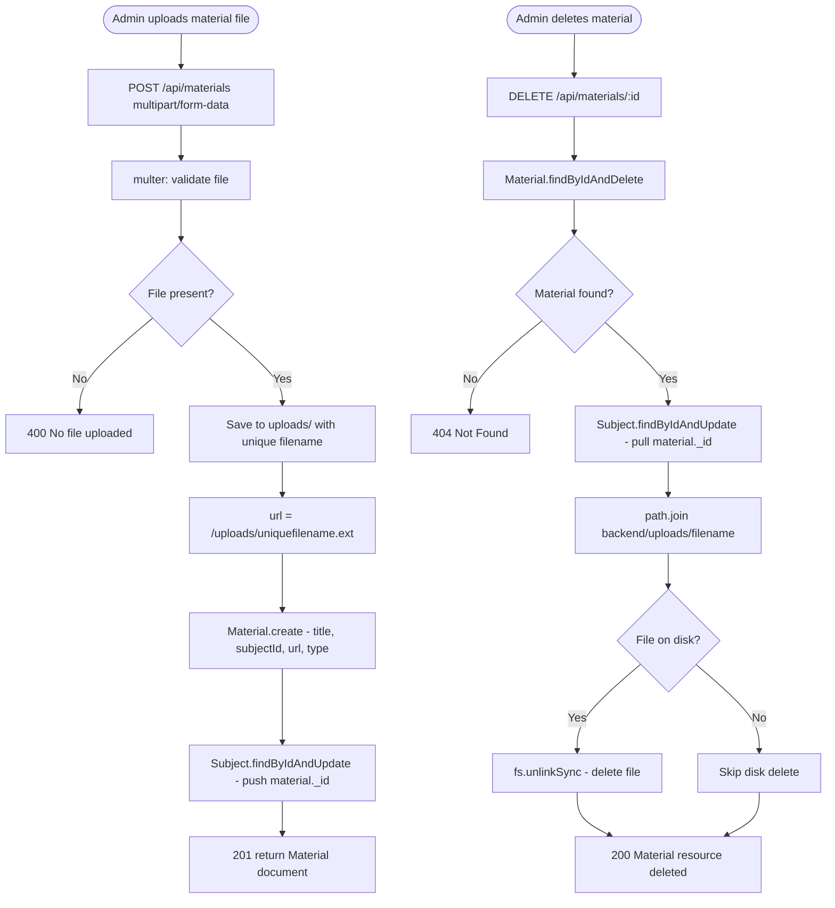
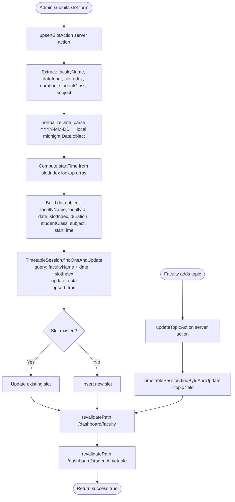
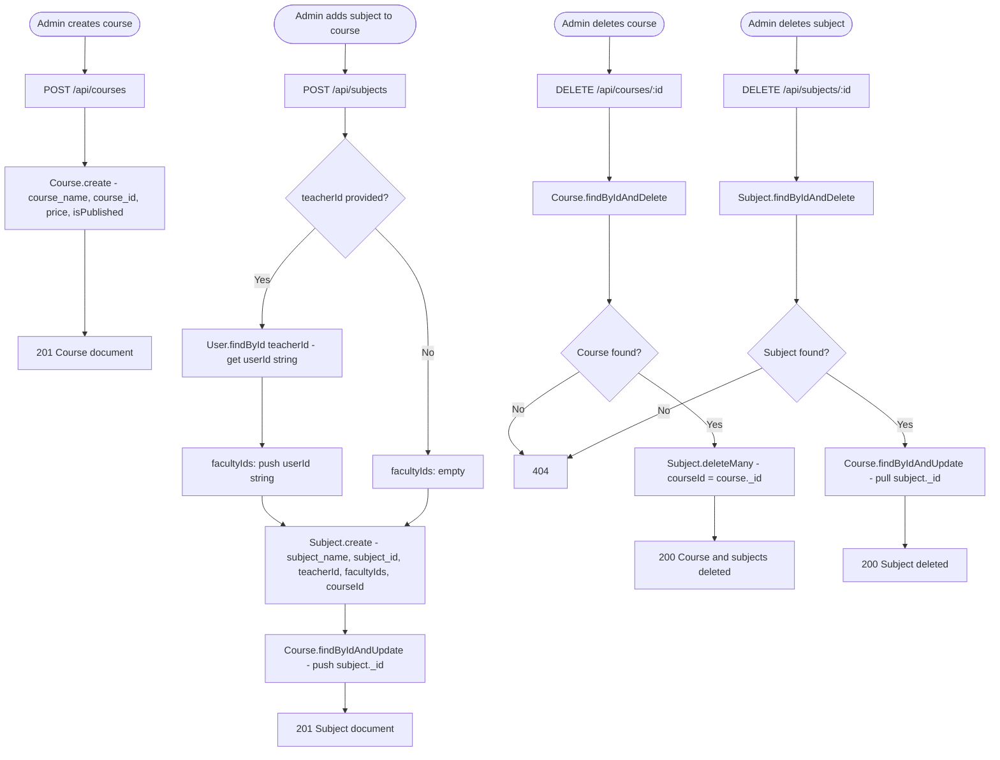
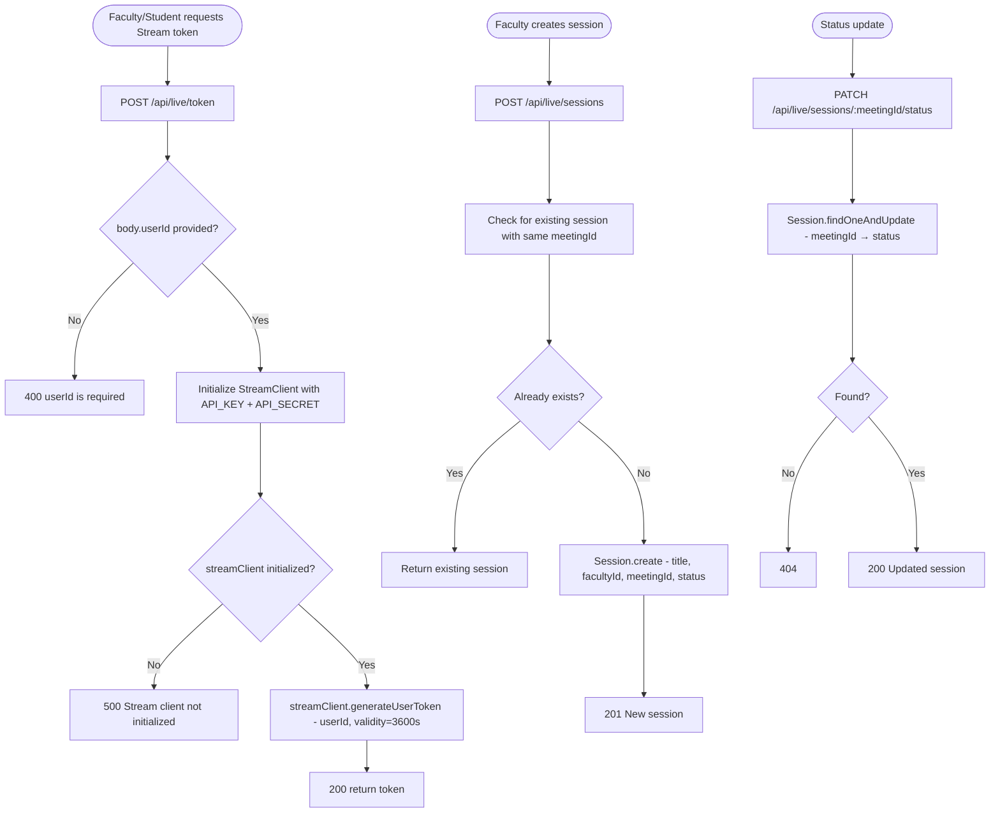
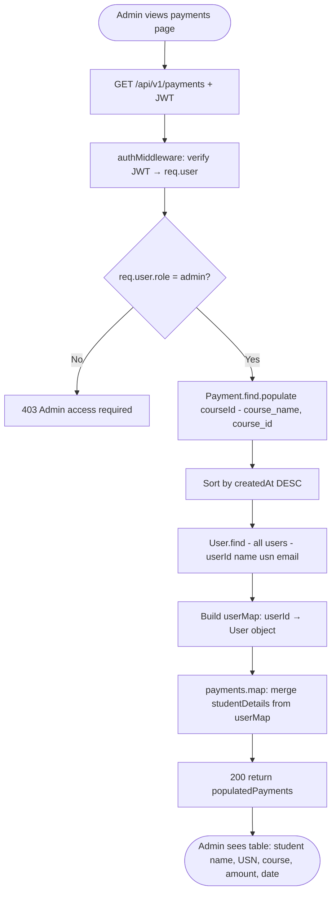

# Activity Diagrams — PPES Platform

Business logic flowcharts for complex multi-step operations. These diagrams capture decision points, branching logic, and process flows derived from controller and route handler code.

---

## 1. Login and Session Bootstrap

Source: `backend/server.js` (`POST /api/auth/login`), `frontend/app/actions/auth.ts`



---

## 2. Test Auto-Grading Algorithm

Source: `backend/controllers/testController.js` (submitAttempt)



---

## 3. Doubt Routing and Access Control

Source: `backend/controllers/doubtController.js`

```mermaid
flowchart TD
    A([Request to GET /api/v1/doubts]) --> B[authMiddleware: verify JWT]
    B --> C{req.user.role?}

    C -- student --> D[query: student_id = req.user.id]
    C -- faculty --> E[query: assigned_teacher_id = req.user.id]
    C -- admin --> F[query: {} empty - sees all]

    D --> G[Apply optional filters: subject_id, teacher_id]
    E --> G
    F --> G

    G --> H[Doubt.find + sort by updated_at DESC]
    H --> I[Batch fetch student User documents]
    I --> J[For each doubt: count unread Messages from other party]
    J --> K[Enrich with student_name, student_grade, has_unread]
    K --> L([Return enrichedDoubts])

    M([Request GET /api/v1/doubts/:id]) --> N[authMiddleware]
    N --> O[Doubt.findById]
    O --> P{Doubt exists?}
    P -- No --> Q[404 Not Found]
    P -- Yes --> R{role = student?}
    R -- Yes --> S{doubt.student_id\n= req.user.id?}
    S -- No --> T[403 Unauthorized]
    S -- Yes --> U[Allow access]
    R -- No --> V{role = faculty?}
    V -- Yes --> W{doubt.assigned_teacher_id\n= req.user.id?}
    W -- No --> T
    W -- Yes --> U
    V -- No --> U

    U --> X[Message.find + sort created_at ASC]
    X --> Y[Message.updateMany - mark others' messages as is_read=true]
    Y --> Z([Return doubt + messages])
```

---

## 4. Material Upload and Linking

Source: `backend/routes/materialRoutes.js`



---

## 5. Timetable Slot Upsert Logic

Source: `frontend/app/actions/timetable.ts` (`upsertSlotAction`)



---

## 6. Course CRUD with Subject Cascade

Source: `backend/routes/courseRoutes.js`, `backend/routes/subjectRoutes.js`



---

## 7. Live Session Token Generation

Source: `backend/server.js` (`POST /api/live/token`, `POST /api/live/sessions`)



---

## 8. Admin Payment Management

Source: `backend/routes/paymentRoutes.js` (`GET /api/v1/payments`)


