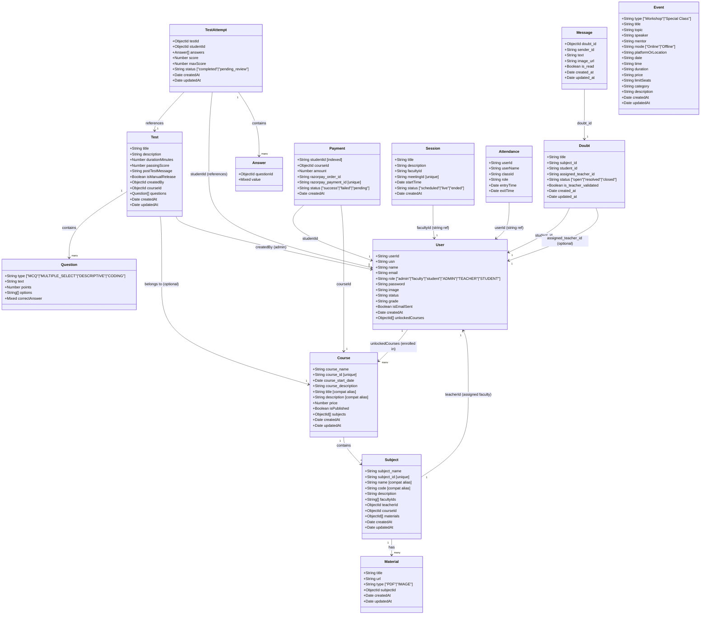
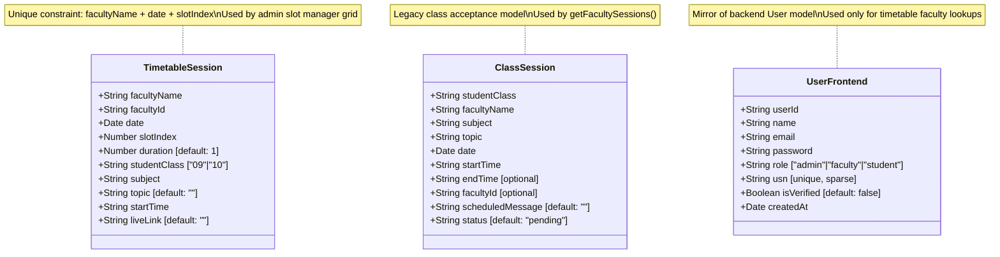

# Class Diagrams — PPES Platform

All classes and their relationships derived from Mongoose schema definitions in `backend/models/` and `frontend/lib/models/`.

---

## 1. Core Domain Models (Backend — Express/MongoDB)

### 1.1 Complete Class Diagram

---

## 2. Frontend Mongoose Models (Next.js Server Actions)

> These models exist in `frontend/lib/models/` and are accessed **directly from Next.js server actions** (bypassing the Express backend).

---

## 3. Relationship Summary

| Relationship | Type | Description |
|---|---|---|
| `User` → `Course` | Many-to-Many (via `unlockedCourses[]`) | A student can be enrolled in multiple courses |
| `Course` → `Subject` | One-to-Many | A course contains multiple subjects |
| `Subject` → `Material` | One-to-Many | A subject has multiple material files |
| `Subject` → `User` | Many-to-One | A subject is taught by one faculty member |
| `Test` → `Course` | Many-to-One (optional) | Tests can be linked to a course |
| `TestAttempt` → `Test` | Many-to-One | Multiple students attempt the same test |
| `TestAttempt` → `User` | Many-to-One | A student may have one attempt per test |
| `Doubt` → `User (student)` | Many-to-One | A student creates doubts |
| `Doubt` → `User (faculty)` | Many-to-One (optional) | A faculty member is assigned to a doubt |
| `Message` → `Doubt` | Many-to-One | A doubt has a thread of messages |
| `Payment` → `User` | Many-to-One | A payment belongs to one student |
| `Payment` → `Course` | Many-to-One | A payment unlocks one course |
| `Attendance` → `Session` | Many-to-One | Multiple attendees per session |

---

## 4. Compatibility Field Note

> [!NOTE]
> The `Course` and `Subject` models contain **duplicate compatibility fields** (`title`/`course_name`, `description`/`course_description`, `name`/`subject_name`, `code`/`subject_id`). These are intentional aliases maintained for frontend component compatibility and were added during a schema migration. The primary fields are the `course_*` and `subject_*` prefixed variants.
