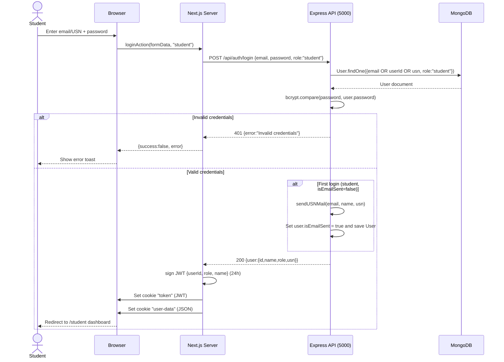
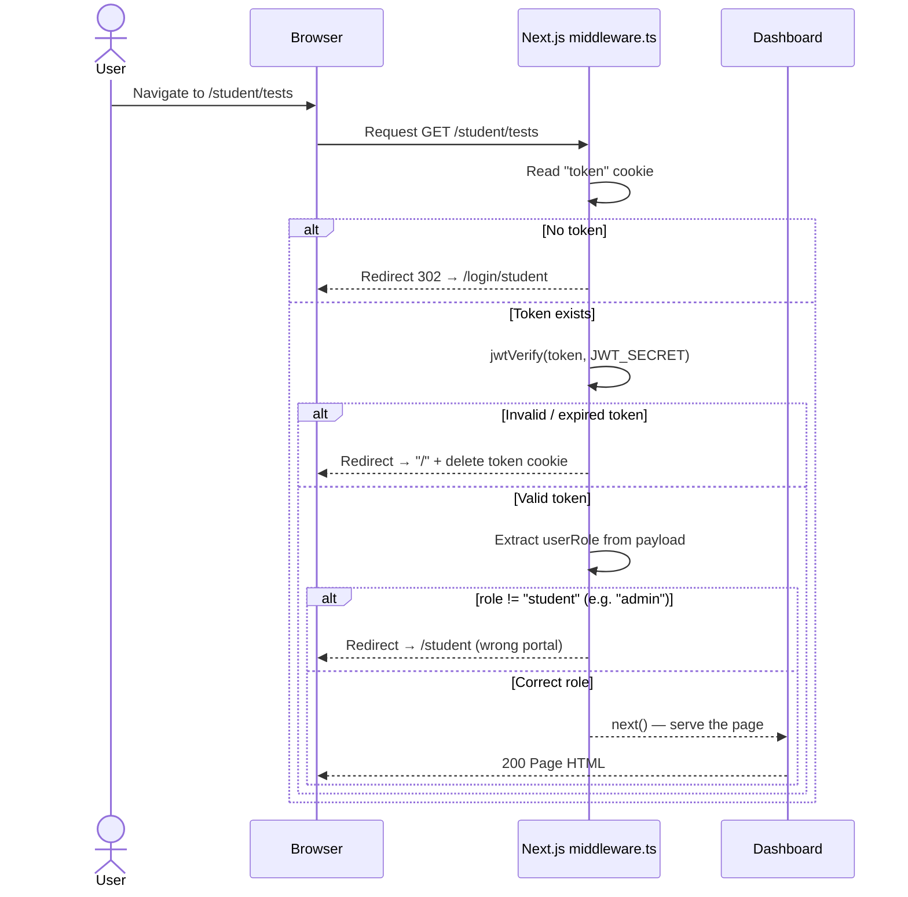
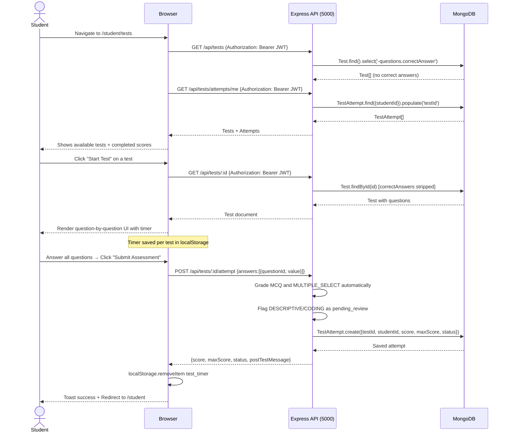
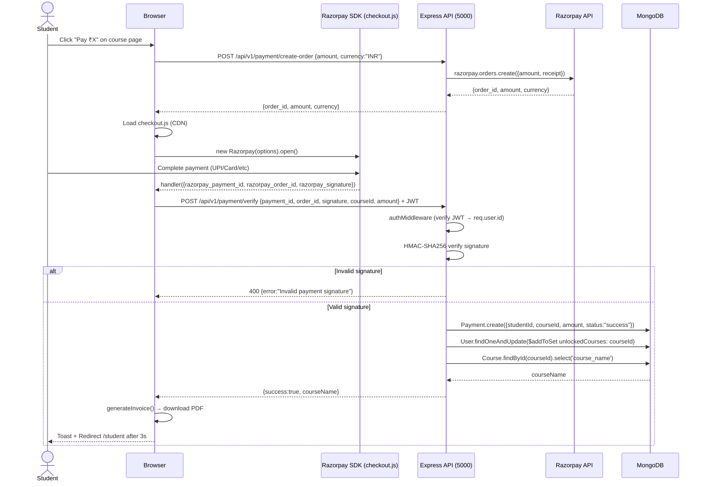
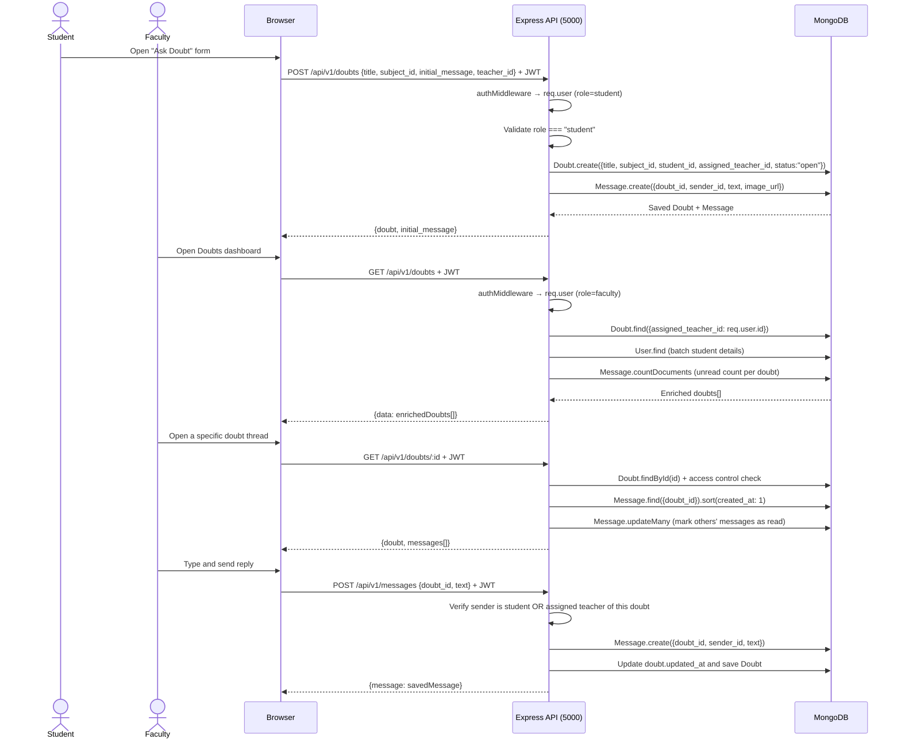
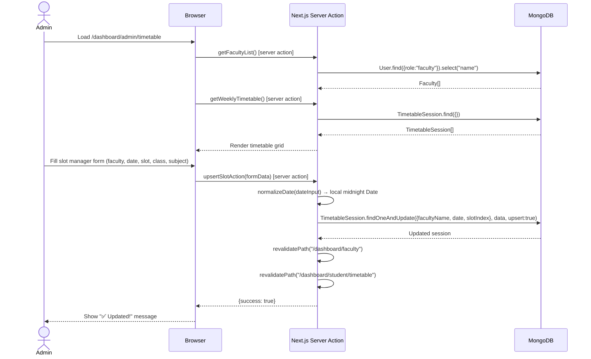
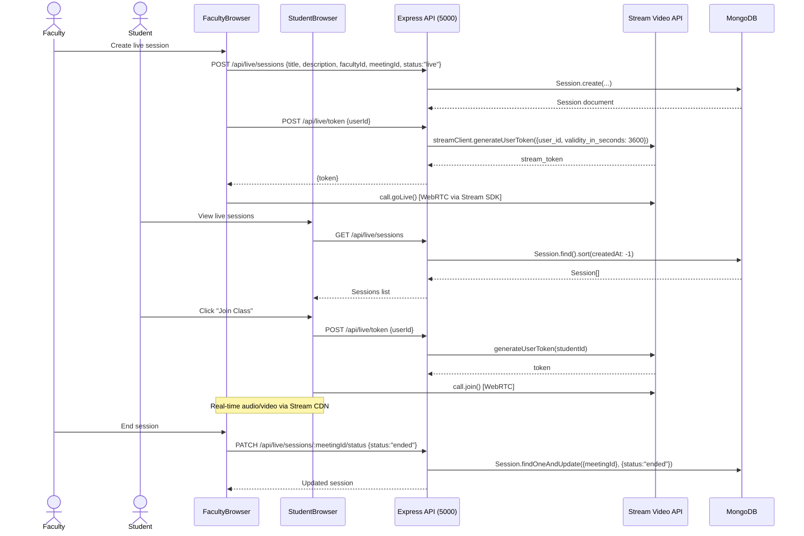
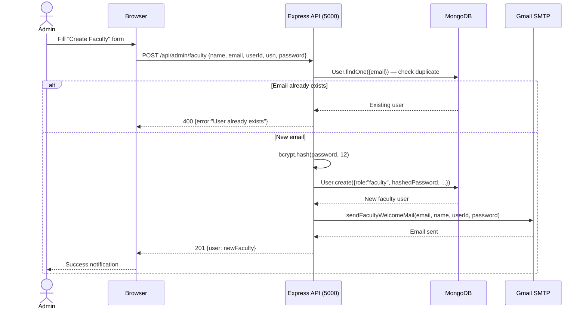

# Sequence Diagrams — PPES Platform

Sequence diagrams for the primary user-facing workflows derived from actual source code in `frontend/`, `backend/`, and `middleware/`.

---

## 1. Student Authentication Flow

Source: `frontend/app/actions/auth.ts`, `backend/server.js` `/api/auth/login`, `frontend/middleware.ts`

---

## 2. Route Protection (Middleware)

Source: `frontend/middleware.ts`

---

## 3. Student Takes a Test

Source: `frontend/app/student/tests/page.tsx`, `frontend/app/student/tests/[id]/page.tsx`, `backend/routes/testRoutes.js`, `backend/controllers/testController.js`

---

## 4. Razorpay Course Purchase

Source: `frontend/components/RazorpayCheckoutButton.tsx`, `backend/routes/paymentRoutes.js`

---

## 5. Doubt Creation and Teacher-Student Chat

Source: `backend/controllers/doubtController.js`, `backend/controllers/messageController.js`, `frontend/lib/api.ts`

---

## 6. Admin Creates Timetable Slot

Source: `frontend/app/dashboard/admin/timetable/page.tsx`, `frontend/app/actions/timetable.ts`

---

## 7. Faculty Hosts a Live Session

Source: `backend/server.js` (live routes), `frontend/components/StreamVideoProvider.tsx`, `frontend/components/MeetingRoom.tsx`

---

## 8. Admin Creates a Faculty Member

Source: `backend/server.js` (`POST /api/admin/faculty`)

