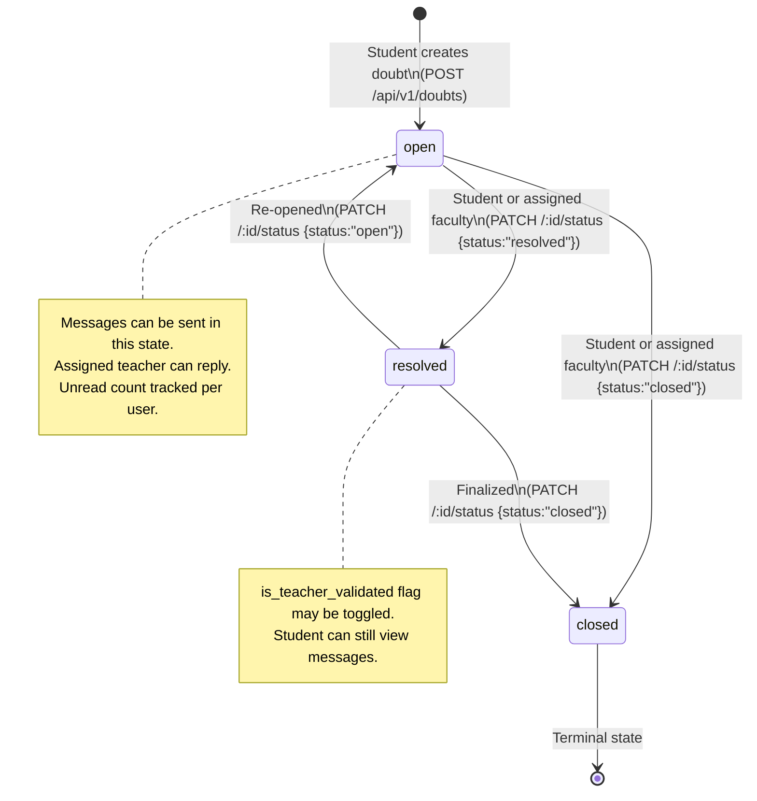
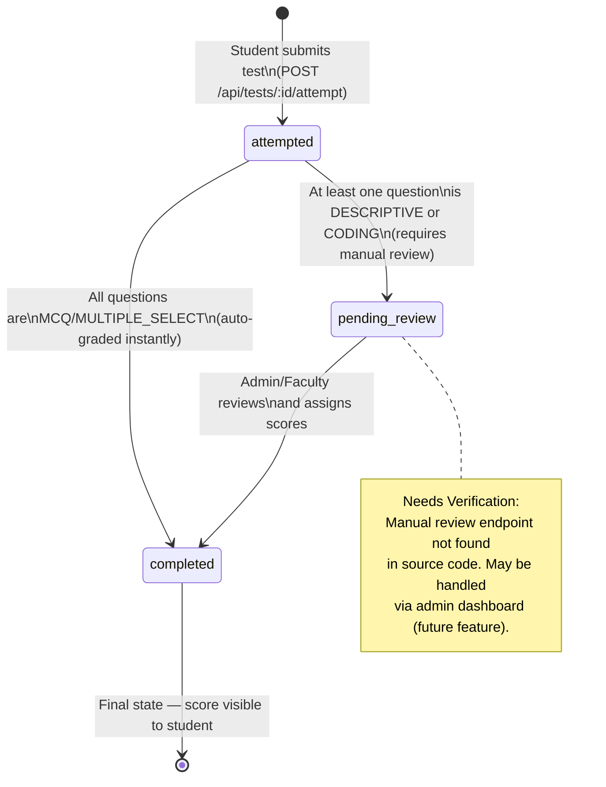
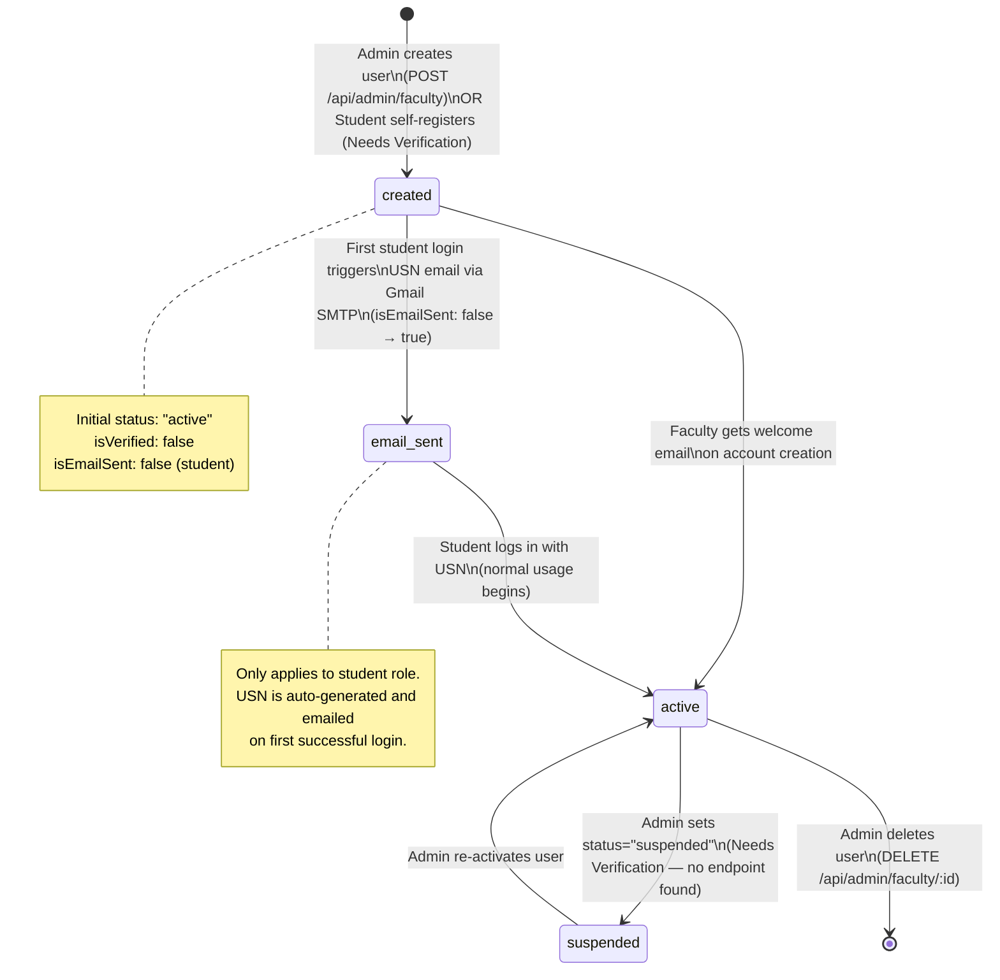
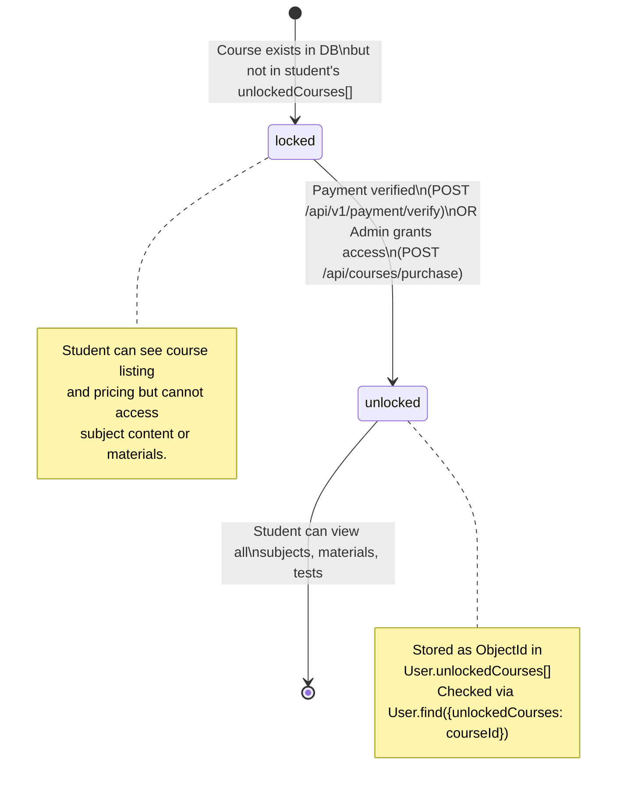
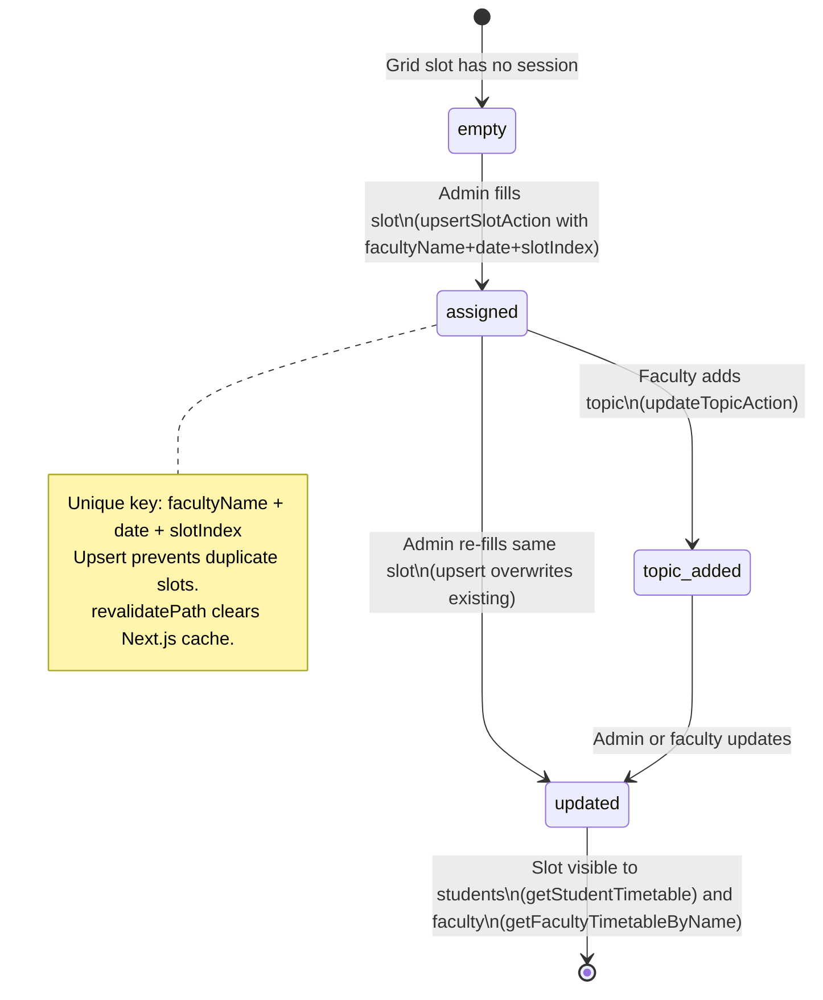

# State Diagrams — PPES Platform

Lifecycle state machines for the core entities in the system, derived from Mongoose schema `enum` fields, controller logic, and route handlers.

---

## 1. Doubt Lifecycle

Source: `backend/models/Doubt.js`, `backend/controllers/doubtController.js`

---

## 2. Test Attempt Status

Source: `backend/models/TestAttempt.js`, `backend/controllers/testController.js`

---

## 3. Payment Status

Source: `backend/models/Payment.js`, `backend/routes/paymentRoutes.js`

```mermaid
stateDiagram-v2
    [*] --> pending : Payment record created before\nRazorpay confirmation

    pending --> success : HMAC signature verified\n(POST /api/v1/payment/verify)

    pending --> failed : Payment failed in Razorpay modal\nor HMAC mismatch detected

    success --> [*] : Student enrolled in course;\ninvoice PDF generated

    failed --> [*] : No enrollment; student may retry

    note right of success
        On success:
        Payment.create() is called
        User.unlockedCourses.push(courseId)
        Invoice generated client-side
    end note

    note left of pending
        Default status in schema is "success"
        because Payment.create() is only
        called after verification succeeds.
        "pending" / "failed" are available
        for future manual record use.
    end note
```

---

## 4. Live Session Lifecycle

Source: `backend/models/Session.js`, `backend/server.js` (live routes)

```mermaid
stateDiagram-v2
    [*] --> scheduled : Faculty creates session\n(POST /api/live/sessions)

    scheduled --> live : Faculty starts broadcast\n(PATCH /api/live/sessions/:meetingId/status)

    live --> ended : Faculty ends session\n(PATCH /api/live/sessions/:meetingId/status)

    ended --> [*] : Session archived;\nstudents can no longer join

    note right of scheduled
        Meeting ID is pre-assigned.
        Stream token already issued.
        Students can see session in list.
    end note

    note right of live
        Students can join via Stream SDK.
        Attendance tracked (Attendance model).
        Whiteboard, polls, resources available.
    end note
```

---

## 5. User Account Lifecycle

Source: `backend/models/User.js`, `backend/server.js` (auth + admin faculty routes)

---

## 6. Course Enrollment State (Per Student)

Source: `backend/models/User.js (unlockedCourses[])`, `backend/routes/courseRoutes.js`, `backend/routes/paymentRoutes.js`

---

## 7. Timetable Slot Lifecycle

Source: `frontend/app/actions/timetable.ts`, `frontend/lib/models/TimetableSession.ts`

