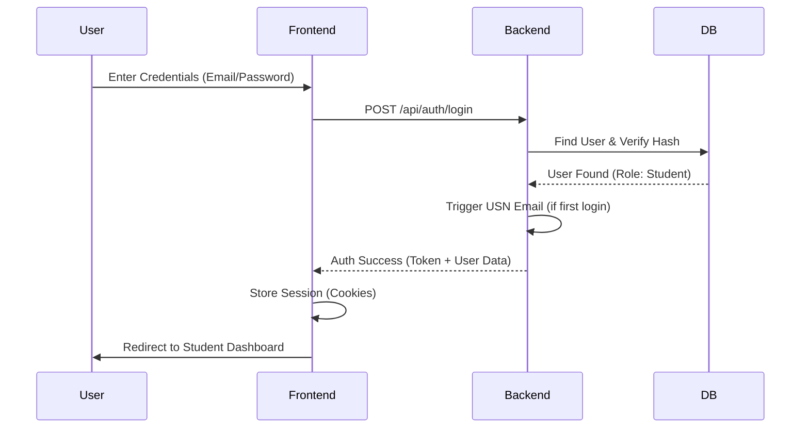
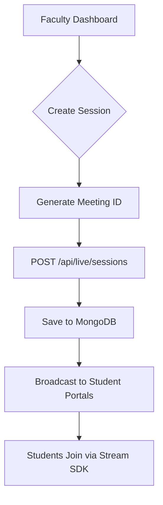
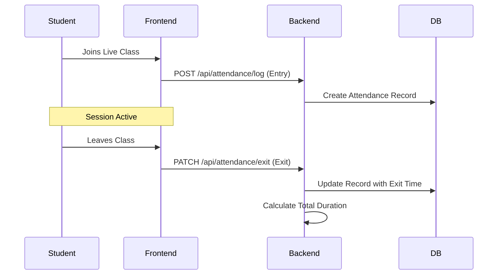

# PPES Classroom Technical Documentation

## 1. Project Overview
PPES Classroom is a modern educational platform designed to facilitate live learning, attendance management, and role-based access for students and faculty. The system is built with a decoupled architecture featuring a Next.js frontend and a Node.js backend, both sharing a MongoDB database.

---

## 2. File Structure

### Frontend (Next.js)
Located in `/frontend`, this directory contains the user interface and client-side logic.

```text
frontend/
├── app/                  # Next.js App Router (Pages & API Routes)
│   ├── (auth)/           # Authentication routes (Login/Register)
│   ├── (main)/           # Public facing pages
│   ├── admin/            # Administrative dashboard and controls
│   ├── faculty/          # Faculty-specific management tools
│   ├── student/          # Student portal and live session access
│   ├── api/              # Internal API endpoints (e.g., Payments)
│   └── layout.tsx        # Root layout with providers
├── components/           # Reusable React components
│   ├── LiveSessionsList.tsx
│   ├── ResourcesPanel.tsx
│   └── UI/               # Shared UI elements (Buttons, Inputs)
├── actions/              # Next.js Server Actions (Database mutations)
├── hooks/                # Custom React hooks
├── lib/                  # Library configurations (Firebase, MongoDB, Auth)
└── public/               # Static assets (Images, Fonts)
```

### Backend (Node.js/Express)
Located in `/backend`, this handles core business logic and background services.

```text
backend/
├── models/               # Mongoose (MongoDB) schemas
│   ├── User.js           # User profiles and roles
│   ├── Session.js        # Live session metadata
│   └── Attendance.js     # Attendance logs
├── server.js             # Main Express entry point & API endpoints
└── package.json          # Backend dependencies
```

---

## 3. Roles of Backend and Frontend

### Frontend Role
- **UI/UX**: Providing a responsive, high-performance interface using Tailwind CSS and Framer Motion.
- **Client-side Logic**: Managing state for live video sessions and interactive UI elements.
- **Direct Database Access**: Using Server Actions for performance-critical tasks like updating user profiles or fetching session lists.
- **Integration**: Embedding Stream IO for video/chat and Razorpay for payment processing.

### Backend Role
- **Business Logic**: Handling complex data aggregations (e.g., attendance reports).
- **Security**: Validating tokens and managing sensitive operations like USN generation.
- **Services**: Running the email service (Nodemailer) to notify students of their credentials.
- **Data Seeding**: Ensuring the database has required initial records (e.g., default admin accounts).

---

## 4. How to Use

### Prerequisites
- Node.js (v18+)
- MongoDB Atlas account (or local MongoDB)
- Stream IO API Keys
- Gmail account (for SMTP email service)

### Backend Setup
1. Navigate to the `backend` folder.
2. Install dependencies: `npm install`
3. Create a `.env` file with the following keys:
   ```env
   PORT=5000
   MONGODB_URI=your_mongodb_uri
   STREAM_API_KEY=your_key
   STREAM_API_SECRET=your_secret
   EMAIL_USER=your_email@gmail.com
   EMAIL_PASS=your_app_password
   ```
4. Start the server: `npm start` (or `npm run dev` for nodemon)

### Frontend Setup
1. Navigate to the `frontend` folder.
2. Install dependencies: `npm install`
3. Create a `.env.local` file with:
   ```env
   MONGODB_URI=your_mongodb_uri
   NEXT_PUBLIC_STREAM_API_KEY=your_key
   STREAM_API_SECRET=your_secret
   ```
4. Run the development server: `npm run dev`
5. Access the app at `http://localhost:3000`

---

## 5. Flow Diagrams

### A. Authentication Flow
This diagram illustrates the process from login to role-based redirection.



### B. Live Session Creation
How faculty members initiate a class.



### C. Attendance Tracking Flow
Real-time logging of user activity during sessions.


